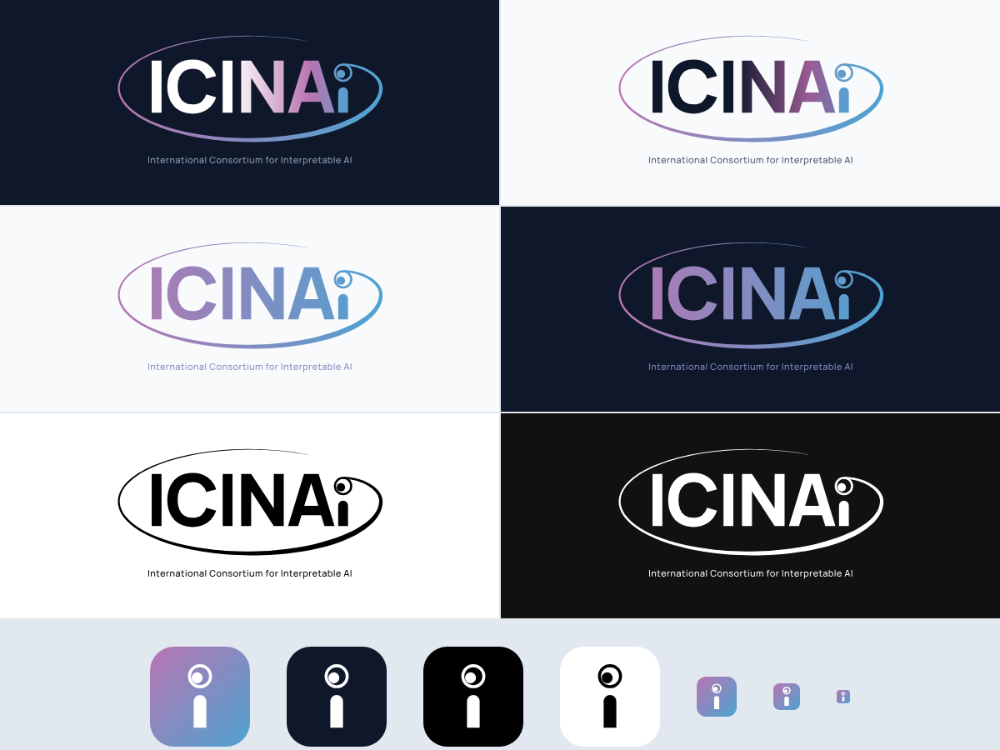

# ICINAi brand assets

Logo, icons and favicons for the International Consortium for Interpretable AI ([icinai.org](https://icinai.org)).



The wordmark reads "AI" first. The final "i" is also a person: shorter than the capitals, standing beside the A, with its dot drawn as an eye looking down and to the left at it. A comet orbit sweeps from above the A round the whole word and closes into the ring of that eye.

## Logo

| File | Use |
|---|---|
| `logo/icinai-logo-color-on-dark.svg` | Primary. White letters fade into the brand gradient. Use on navy or other dark grounds. |
| `logo/icinai-logo-color-on-light.svg` | Primary on white or light grounds. Navy letters fade into the gradient. |
| `logo/icinai-logo-gradient.svg` | Color variant: the whole mark in the gradient. Works on light or dark. |
| `logo/icinai-logo-black.svg` | One-color black. |
| `logo/icinai-logo-white.svg` | One-color white. |

Each has a `lockup` version with the full name set below (`logo/icinai-lockup-*.svg`). PNG renders at 1200 and 600 px wide are in `png/`.

Keep clear space around the logo equal to the height of the eye. Don't recolor, stretch or rearrange the parts. Below about 120 px wide, use the app icon instead.

## Icons

| File | Use |
|---|---|
| `icon/icinai-app-icon.svg` | App and social avatar: gradient tile, white figure (the i with its eye, body shortened, no orbit). |
| `icon/icinai-app-icon-navy.svg`, `-black.svg`, `-white.svg` | Tile alternatives. |
| `icon/icinai-mark-gradient.svg`, `-black.svg`, `-white.svg` | The figure alone, no tile. |
| `icon/favicon.svg`, `icon/favicon.ico` | Browser favicon (heavier strokes for 16 and 32 px). |
| `png/apple-touch-icon.png` | 180 px iOS home-screen icon. |
| `png/icinai-social-card.png` | 1200 × 630 link-preview image (Open Graph / Twitter). |

Favicon markup:

```html
<link rel="icon" href="/favicon.ico" sizes="any">
<link rel="icon" href="/favicon.svg" type="image/svg+xml">
<link rel="apple-touch-icon" href="/apple-touch-icon.png">
```

## Color

Shared with [NDIF](https://ndif.us).

| | Hex |
|---|---|
| Gradient start (purple) | `#B875B1` |
| Gradient middle | `#838CC1` |
| Gradient end (blue) | `#4EA3D1` |
| Navy ground | `#0F172A` |
| Light ground | `#F8FAFC` |
| Tagline on dark | `#94A3B8` |
| Tagline on light | `#475569` |

## Type

[Manrope](https://fonts.google.com/specimen/Manrope) (SIL Open Font License): ExtraBold 800 for the wordmark, Medium 500 for the tagline. The website uses Manrope for headings and DM Sans for body text. All text in the SVGs is converted to outlines, so no font needs to be installed.

## Rebuilding

`source/build.py` generates every file from the geometry and palette defined at the top of the script.

```sh
npm pack @fontsource/manrope && tar xzf fontsource-manrope-*.tgz
pip install numpy fonttools pillow playwright
python3 source/build.py package/files
```
